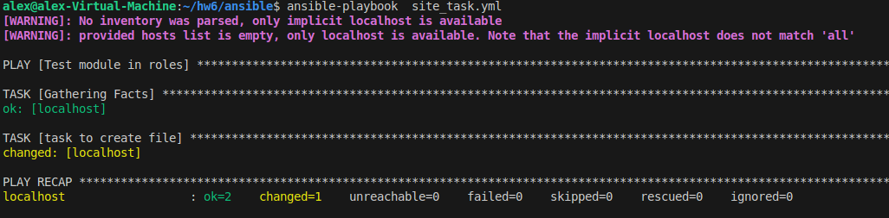

## Отчёт

 Сслыка на коллекцию: https://github.com/StudentIrgups/ansible-collection/tree/main/step14/collection/ansible_collections/bars_namespace/netology
 
 Архив с коллекцией: https://github.com/StudentIrgups/ansible-collection/blob/main/step14/bars_namespace-netology-1.0.0.tar.gz

 Скриншоты 4, 6, 15 и 16 пунктов:

